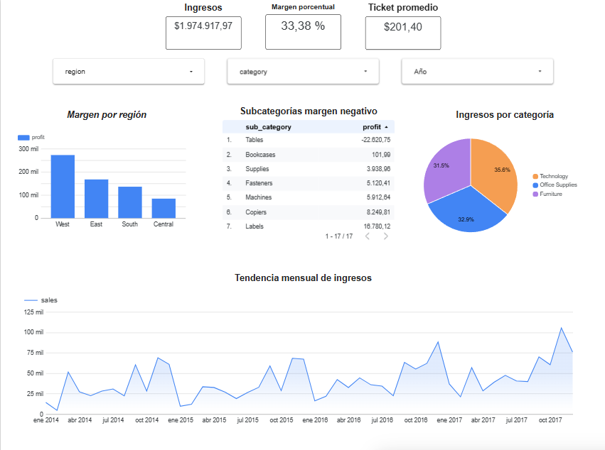

# Superstore Analytics — Dashboard de ventas y rentabilidad

Análisis de rentabilidad sobre ~10K pedidos, como preparación para un rol
de Data Analyst en Revenue Operations. El foco es cruzar ingreso con margen
para identificar dónde se gana y dónde se pierde dinero, no solo mirar volumen.

## Dataset
Superstore (Kaggle) — ingresos, margen, región, categoría y subcategoría.
Montado en BigQuery; los nombres de columna se sanean a snake_case y los
campos numéricos se castean en una vista (`00_setup_view.sql`).

## Consultas
| Archivo | Pregunta de negocio | Técnica SQL |
|---|---|---|
| `01_margen_por_segmento.sql` | Rentabilidad por región/categoría/mes | GROUP BY, agregaciones |
| `02_subcategorias_margen_negativo.sql` | Subcategorías que venden pero pierden | HAVING |
| `03_ticket_promedio_ranking.sql` | Ranking de ticket promedio por región | RANK() window |
| `04_month_over_month.sql` | Crecimiento mes a mes | LAG(), CTE |

## Hallazgos principales
- **Subcategorías con margen negativo:** Tables con un margen del 0.138% — candidata a revisar descuentos.
- **Rentabilidad por región:**
  1. South - ticket promedio de 222.71
  2. East - ticket promedio de 202.98
  3. Central - ticket promedio de 196.45
  4. West - ticket promedio de 192.72

## Dashboard
## Dashboard
   [Ver dashboard en Looker Studio](https://datastudio.google.com/reporting/29cffc9a-fc69-4a55-9462-b7977dadf359)

   
